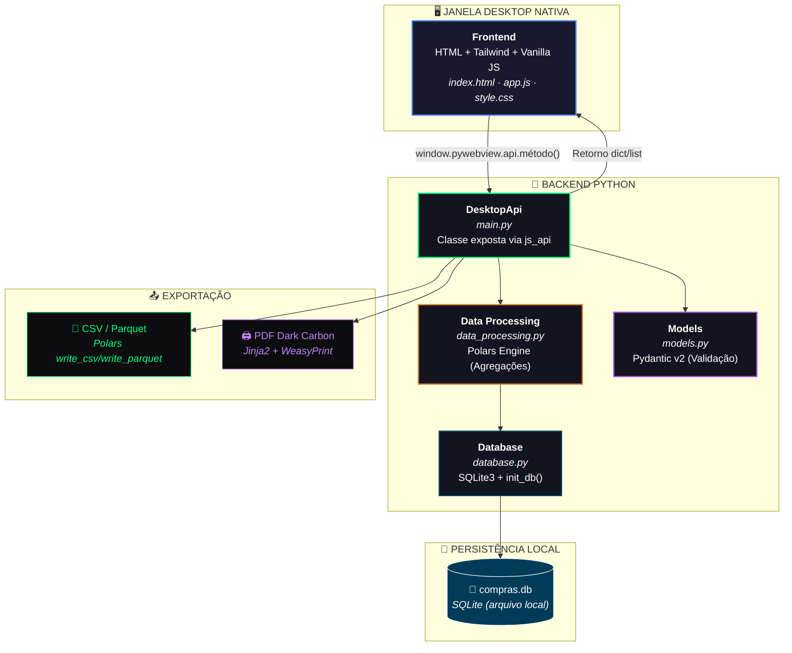
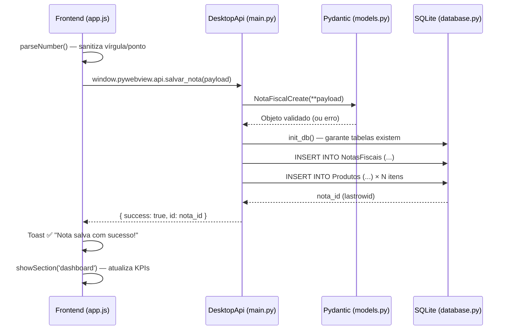
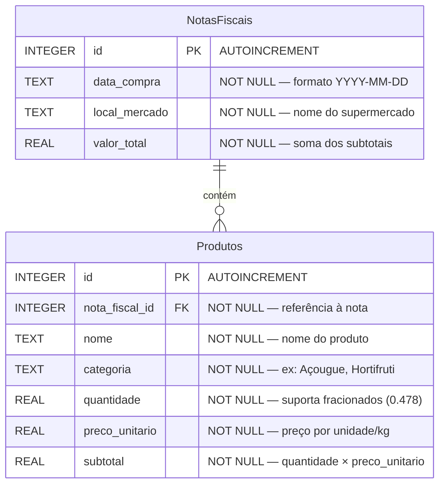

<div align="center">

# 🛒 Compras.io Desktop

### Sistema de Gestão de Compras de Supermercado & Controle de Estoque

**100% Offline · Desktop Nativo · Alto Desempenho**

Um aplicativo desktop moderno para registrar notas fiscais de supermercado, acompanhar a variação de preços dos produtos e gerar relatórios analíticos — tudo localmente, sem dependência de internet ou servidores externos.

---


</div>

---

## 📋 Índice

- [Principais Funcionalidades](#-principais-funcionalidades)
- [Screenshots & Interface](#-screenshots--interface)
- [Arquitetura do Sistema](#-arquitetura-do-sistema)
- [Modelagem de Banco de Dados](#-modelagem-de-banco-de-dados)
- [Stack Tecnológica](#-stack-tecnológica)
- [Como Executar (Instalação & Setup)](#-como-executar-instalação--setup)
- [Estrutura de Diretórios](#-estrutura-de-diretórios)
- [Exportação de Relatórios](#-exportação-de-relatórios)
- [Testes](#-testes)
- [Compilação para .exe](#-compilação-para-exe)
- [Roadmap](#-roadmap)

---

## ✨ Principais Funcionalidades

- **📝 Cadastro em Lote de Notas Fiscais** — Registre múltiplos produtos vinculados a uma única nota fiscal, informando data, mercado e itens comprados.
- **⚖️ Suporte a Gramaturas e Pesos Fracionados** — Campos numéricos aceitam valores decimais como `0.478 kg` de linguiça, com validação `step="any"` e parsing seguro de vírgula/ponto.
- **📊 Dashboard de KPIs em Tempo Real** — Visualize o gasto total do mês, o produto mais comprado e a evolução de gastos mensais com gráficos de barras interativos.
- **🔍 Histórico de Preços & Filtros** — Consulte todo o histórico de compras com JOIN entre notas e produtos, com busca instantânea por nome de produto.
- **📄 Exportação de Dados Brutos (CSV / Parquet)** — Exporte o histórico completo para análise em ferramentas de BI, Polars, Pandas ou Apache Spark.
- **🖨️ Relatório Visual PDF (Dark Carbon)** — Gere relatórios formatados com design premium escuro, contendo KPIs, Top 5 Produtos e tabela completa do histórico.
- **🖥️ Interface Desktop Nativa** — Janela nativa do sistema operacional via PyWebView, sem navegador externo, sem internet.
- **💾 Persistência 100% Local** — Banco de dados SQLite embutido com inicialização resiliente e caminho absoluto fixo.
- **🎨 UI Moderna com Glassmorphism** — Interface Dark Mode com efeitos de vidro fosco, gradientes, micro-animações e tipografia monospace (Fira Code + Inter).
- **📦 Compilável para .exe** — Preparado para empacotamento com PyInstaller, tratando caminhos via `sys._MEIPASS`.
- **🖱️ Gráficos Interativos** — Clique nas barras de evolução mensal no dashboard para isolar e analisar os gastos de meses específicos no KPI principal.
- **✏️ Edição Dinâmica de Registros** — Edite datas, nomes, quantidades e preços diretamente pela tabela de histórico com recálculo automático do valor total da nota no banco de dados.

---

## 🖼️ Screenshots & Interface

| Dashboard | Nova Compra | Histórico & Exportação |
|:---------:|:-----------:|:---------------------:|
| Gráficos de barras interativos com gastos mensais (clique para isolar mês) e ranking de produtos | Formulário com itens dinâmicos e prévia do total em tempo real | Tabela com filtro, botão de edição rápida ✏️ e exportação CSV/Parquet/PDF |

> A interface utiliza um design **Dark Glassmorphism** com paleta de cores: `#0a0a0c` (fundo), `#5b8cff` (azul primário), `#00ff88` (verde acento) e `#9d4edd` (roxo acento). O **Dashboard** agora é interativo — clique nas barras para detalhar gastos por mês. A **tabela de Histórico** inclui edição in-app com recálculo automático.

---

## 🏗️ Arquitetura do Sistema

O sistema segue uma arquitetura **Desktop Híbrida**, onde o frontend HTML/CSS/JS é renderizado dentro de uma janela nativa do sistema operacional via **PyWebView**. Toda a comunicação entre a interface e a lógica de negócios acontece por meio de uma **ponte Python-JavaScript** (`window.pywebview.api`), sem HTTP, sem REST, sem internet.



### Fluxo de uma Operação (Exemplo: Salvar Nota Fiscal)



---

## 🗄️ Modelagem de Banco de Dados

### Diagrama Entidade-Relacionamento (ER)



### Lógica Relacional

O banco utiliza um modelo relacional **1:N (um-para-muitos)**: cada registro na tabela `NotasFiscais` representa uma ida ao supermercado (com data, local e valor total), enquanto a tabela `Produtos` armazena cada item individual comprado nessa visita.

A coluna `nota_fiscal_id` em `Produtos` atua como **chave estrangeira (FK)** apontando para o `id` da `NotasFiscais`, permitindo:

- **Rastreabilidade completa**: saber exatamente onde e quando cada produto foi comprado.
- **Agregações eficientes**: o Polars faz `JOIN` entre as tabelas para construir o histórico de preços e calcular KPIs.
- **Integridade referencial**: a constraint `FOREIGN KEY` garante que não existam produtos órfãos sem nota fiscal associada.

Todos os campos numéricos usam o tipo `REAL` do SQLite (ponto flutuante de 64 bits), permitindo gramaturas fracionadas como `0.478 kg` e preços com centavos.

---

## 🛠️ Stack Tecnológica

| Camada | Tecnologia | Versão | Função |
|--------|------------|--------|--------|
| **Interface** | HTML5 + Tailwind CSS | 3.x (CDN) | Estrutura e estilização da UI |
| **Lógica Frontend** | Vanilla JavaScript (ES6+) | — | Eventos, SPA navigation, fetch API |
| **Janela Desktop** | PyWebView | ≥ 6.0 | Renderiza o HTML em janela nativa do OS |
| **Validação** | Pydantic | ≥ 2.0 | Validação e tipagem dos payloads JSON |
| **Processamento** | Polars | ≥ 1.0 | Agregações de alta performance (groupby, join, cast) |
| **Suporte Dados** | Pandas + PyArrow | ≥ 2.0 / ≥ 15.0 | Compatibilidade com Parquet e interop |
| **Banco de Dados** | SQLite3 | Embutido | Persistência local sem instalação |
| **Template PDF** | Jinja2 | ≥ 3.1 | Renderização de template HTML com dados dinâmicos |
| **Geração PDF** | WeasyPrint | ≥ 62.0 | Conversão HTML/CSS → PDF com fidelidade visual |
| **Testes** | Pytest | ≥ 8.0 | Testes end-to-end automatizados |
| **Empacotamento** | PyInstaller | ≥ 6.0 | Compilação para executável `.exe` |

---

## 🚀 Como Executar (Instalação & Setup)

### Pré-requisitos

- **Python 3.10+** instalado e no PATH
- **Git** (para clonar o repositório)

### 1. Clonar o repositório

```bash
git clone https://github.com/seu-usuario/compras-io-desktop.git
cd compras-io-desktop
```

### 2. Criar e ativar o ambiente virtual

**Windows (PowerShell):**
```powershell
python -m venv venv
.\venv\Scripts\Activate.ps1
```

**Windows (CMD):**
```cmd
python -m venv venv
.\venv\Scripts\activate.bat
```

**Linux / macOS:**
```bash
python3 -m venv venv
source venv/bin/activate
```

### 3. Instalar dependências

```bash
pip install -r requirements.txt
```

### 4. Iniciar o aplicativo

```bash
python backend/main.py
```

> A janela desktop nativa será aberta automaticamente. Nenhum navegador externo é necessário.

### 5. Executar os testes (opcional)

```bash
pytest backend/tests/ -v
```

---

## 📁 Estrutura de Diretórios

```
compras-io-desktop/
│
├── 📄 README.md                         # Este arquivo — documentação do projeto
├── 📄 requirements.txt                  # Dependências Python do projeto
├── 📁 compras.db                        # Banco SQLite (criado automaticamente na 1ª execução)
│
├── 📂 backend/                          # Toda a lógica Python (servidor desktop)
│   ├── 📄 __init__.py                   # Torna o diretório um módulo Python importável
│   ├── 📄 main.py                       # Ponto de entrada — DesktopApi + PyWebView window
│   ├── 📄 database.py                   # Conexão SQLite, CREATE TABLE, init_db(), DB_PATH
│   ├── 📄 models.py                     # Schemas Pydantic (NotaFiscalCreate, ProdutoCreate)
│   ├── 📄 data_processing.py            # Lógica Polars (KPIs, histórico, exportação CSV/Parquet/PDF)
│   │
│   ├── 📂 templates/                    # Templates Jinja2 para geração de relatórios
│   │   └── 📄 relatorio.html            # Template Dark Carbon para PDF (WeasyPrint)
│   │
│   └── 📂 tests/                        # Suíte de testes automatizados
│       ├── 📄 __init__.py               # Torna o diretório de testes importável
│       └── 📄 test_app.py               # Testes E2E (CRUD, validação fracionados, exportação)
│
├── 📂 frontend/                         # Interface do usuário (renderizada via PyWebView)
│   ├── 📄 index.html                    # Estrutura HTML — Dashboard, Formulário, Histórico
│   ├── 📄 app.js                        # Lógica JS — SPA navigation, handlers, toasts
│   └── 📄 style.css                     # Estilos customizados — glassmorphism, animações, export UI
│
└── 📂 venv/                             # Ambiente virtual Python (não versionado — .gitignore)
```

### Responsabilidade de cada arquivo-chave

| Arquivo | Responsabilidade |
|---------|-----------------|
| `main.py` | Define a classe `DesktopApi` (funções expostas ao JS via `js_api`), gerencia o ciclo de vida da janela PyWebView, e implementa os File Dialogs nativos para exportação. |
| `database.py` | Calcula o `DB_PATH` absoluto (compatível com PyInstaller), implementa `init_db()` com `CREATE TABLE IF NOT EXISTS` resiliente, e exporta `get_connection()`. |
| `models.py` | Define os schemas Pydantic v2 para validação estrita dos payloads: `NotaFiscalCreate`, `ProdutoCreate`, `NotaFiscalResponse`, `ProdutoResponse`. |
| `data_processing.py` | Contém toda a lógica de consulta e agregação via Polars: gastos mensais, produtos populares, histórico de preços, exportação CSV/Parquet, e geração de PDF Dark Carbon. |
| `relatorio.html` | Template Jinja2 com CSS embutido para o relatório PDF. Design Dark Carbon com fundo `#0d0d0f`, tipografia monospace, KPI cards com gradientes, e tabela estilizada. |
| `app.js` | Navegação SPA entre seções, comunicação com `window.pywebview.api`, renderização dinâmica de gráficos/tabelas, sistema de Toast notifications, e handlers de exportação com loading states. |
| `style.css` | Importação de Google Fonts (Inter + Fira Code), variáveis CSS, componentes glassmorphism, scrollbar customizada, animações, estilos de botões de exportação, dropdown e toasts. |

---

## 📤 Exportação de Relatórios

### Dados Brutos (CSV / Parquet)

Na aba **"Histórico & Preços"**, clique no botão **📄 Exportar** e escolha o formato:

| Formato | Caso de Uso | Biblioteca |
|---------|-------------|------------|
| **CSV** | Abrir no Excel, Google Sheets, ou ferramentas de BI | `polars.write_csv()` |
| **Parquet** | Análise de alto desempenho com Polars, Pandas ou Spark | `polars.write_parquet()` + PyArrow |

Um **File Dialog nativo do Windows** ("Salvar Como...") é aberto para o usuário escolher o destino.

### Relatório PDF (Dark Carbon)

Clique no botão **🖨️ PDF** para gerar um documento visual contendo:

- **Header** com logo e data/hora de geração
- **3 KPI Cards**: Gasto Total Acumulado, Total de Registros, Categorias Únicas
- **Top 5 Produtos** mais comprados (com quantidade e valor)
- **Tabela completa** do histórico com todas as colunas
- **Rodapé** com paginação automática

O design utiliza fundo **Dark Carbon** (`#0d0d0f`), detalhes em ciano (`#00ff88`) e azul (`#5b8cff`), gerado via **Jinja2 → WeasyPrint**.

---

## 🧪 Testes

O projeto inclui uma suíte de testes E2E com **pytest**:

```bash
# Executar todos os testes com output detalhado
pytest backend/tests/ -v

# Executar um teste específico
pytest backend/tests/test_app.py::test_nome_do_teste -v
```

### Cobertura dos Testes

| Teste | O que valida |
|-------|-------------|
| Inserção de Nota Fiscal | Criação completa de nota + produtos no SQLite |
| Consulta de KPIs | Agregações Polars retornam dados corretos |
| Valores Fracionados | Gramatura `0.478` é persistida e lida corretamente (`Float64 / REAL`) |
| Histórico com JOIN | `JOIN` entre tabelas retorna dados íntegros |

---

## 📦 Compilação para .exe

O projeto está preparado para empacotamento com **PyInstaller**:

```bash
pyinstaller --onefile --windowed \
    --add-data "frontend;frontend" \
    --add-data "backend/templates;backend/templates" \
    --name "ComprasIO" \
    backend/main.py
```

> **Nota:** O código já trata caminhos estáticos via `sys._MEIPASS` em `main.py` (para o frontend) e `sys.executable` em `database.py` (para o banco SQLite), garantindo que o `.exe` funcione corretamente em qualquer diretório.

---

## 🗺️ Roadmap

- [x] Cadastro de Notas Fiscais com múltiplos produtos
- [x] Suporte a valores fracionados (gramatura/peso)
- [x] Dashboard com KPIs e gráficos de barras
- [x] Histórico de preços com busca/filtro
- [x] Exportação CSV e Parquet
- [x] Relatório PDF Dark Carbon
- [x] Toast Notifications visuais
- [x] Testes automatizados E2E
- [x] Gráficos interativos no Dashboard (clique para isolar mês)
- [x] Edição de registros in-app com recálculo automático
- [ ] Gráficos SVG embutidos no PDF (via matplotlib)
- [ ] Comparativo de preços entre mercados
- [ ] Sistema de alertas de inflação por produto
- [ ] Importação de notas via OCR (foto da nota fiscal)
- [ ] Sincronização opcional entre dispositivos (SQLite → Turso)

---

<div align="center">

**Feito com 🐍 Python + ☕ Café**

`compras.io` — Gestão inteligente de compras, 100% offline.

</div>
